# Schema Diagrams

These Mermaid diagrams are based on the tables currently loaded into `Base.metadata`
through `app.models.__init__`.

Note: `app/models/job.py`, `app/models/job_application.py`, and
`app/models/resources.py` exist in the repo but are not imported into the live model
metadata, so they are intentionally omitted here.

## ERD

```mermaid
erDiagram
  banned_words {
    int id PK
    string word
    datetime created_at
  }
  conversations {
    int id PK
    datetime created_at
  }
  users {
    int id PK
    string email
    string full_name
    string university
    int grad_year
    string major
    string user_role
    string password_hash
    bool is_active
    bool is_verified
    string verification_status
    string verification_token
    string password_reset_token
    datetime password_reset_expires
    datetime created_at
  }
  activities {
    int id PK
    int user_id FK
    string activity_type
    int reference_id
    string description
    datetime created_at
  }
  alumni_profiles {
    int id PK
    int user_id FK
    string university_name
    string course_completed
    int graduation_year
    string certificate_url
    string certificate_public_id
    datetime certificate_uploaded_at
    datetime created_at
    datetime updated_at
  }
  communities {
    int id PK
    string name
    text description
    string type
    string university
    bool is_private
    int creator_id FK
    bool is_active
    string cover_image_url
    string cover_image_public_id
    datetime created_at
  }
  connections {
    int id PK
    int requester_id FK
    int receiver_id FK
    string status
    datetime created_at
  }
  conversation_participants {
    int id PK
    int conversation_id FK
    int user_id FK
    datetime joined_at
  }
  events {
    int id PK
    int organizer_id FK
    string title
    text description
    string location
    datetime event_date
    string event_type
    int max_attendees
    bool is_active
    string cover_image_url
    string cover_image_public_id
    datetime created_at
  }
  mentor_profiles {
    int id PK
    int user_id FK
    text bio
    string linkedin_url
    array expertise_areas
    array mentorship_goals
    json availability_slots
    int max_mentees
    bool is_active
    datetime created_at
    datetime updated_at
  }
  mentorship_preferences {
    int id PK
    int user_id FK
    bool is_mentor
    bool is_mentee
    json areas_of_interest
    int availability_hours_per_week
    string preferred_format
    datetime created_at
    datetime updated_at
  }
  mentorship_relationships {
    int id PK
    int mentor_id FK
    int mentee_id FK
    string goal
    string meeting_frequency
    int session_length_minutes
    string status
    datetime started_at
    datetime ended_at
  }
  mentorship_requests {
    int id PK
    int mentee_id FK
    int mentor_id FK
    string goal
    string meeting_frequency
    int session_length_minutes
    text message
    string attachment_file_path
    string status
    datetime created_at
  }
  mentorships {
    int id PK
    int mentor_id FK
    int mentee_id FK
    string status
    text message
    datetime created_at
    datetime updated_at
  }
  messages {
    int id PK
    int conversation_id FK
    int sender_id FK
    text content
    string image_url
    string image_public_id
    bool is_read
    datetime created_at
  }
  notifications {
    int id PK
    int recipient_id FK
    int sender_id FK
    string type
    int reference_id
    bool is_read
    datetime created_at
  }
  professional_profiles {
    int id PK
    int user_id FK
    string job_title
    string company
    string industry_sector
    int years_of_experience
    string linkedin_url
    datetime created_at
    datetime updated_at
  }
  profiles {
    int id PK
    int user_id FK
    string avatar_url
    string avatar_public_id
    string headline
    text bio
    string university
    int graduation_year
    string major
    string company
    string job_title
    text goals
    json skills
    json interests
    datetime updated_at
  }
  refresh_tokens {
    int id PK
    int user_id FK
    string token_hash
    bool revoked
    datetime expires_at
  }
  student_profiles {
    int id PK
    int user_id FK
    string university_name
    string course_title
    int year_of_study
    int expected_graduation
    datetime created_at
    datetime updated_at
  }
  user_roles {
    int id PK
    int user_id FK
    string role
  }
  community_invites {
    int id PK
    int community_id FK
    int created_by FK
    string token
    int use_count
    datetime created_at
  }
  community_members {
    int id PK
    int community_id FK
    int user_id FK
    string role
    datetime joined_at
  }
  community_messages {
    int id PK
    int community_id FK
    int sender_id FK
    text content
    int reply_to_id FK
    datetime created_at
  }
  community_posts {
    int id PK
    int community_id FK
    int author_id FK
    string title
    text content
    string category
    string image_url
    string image_public_id
    datetime created_at
  }
  event_registrations {
    int id PK
    int event_id FK
    int user_id FK
    string status
    datetime registered_at
  }
  mentorship_milestones {
    int id PK
    int relationship_id FK
    string title
    text description
    string status
    int sort_order
    date target_date
    date completed_date
    datetime created_at
    datetime updated_at
  }
  mentorship_resources {
    int id PK
    int relationship_id FK
    int shared_by_id FK
    string title
    string category
    string url
    text note
    datetime created_at
  }
  mentorship_reviews {
    int id PK
    int relationship_id FK
    int reviewer_id FK
    int reviewee_id FK
    int rating
    text review_text
    datetime created_at
  }
  mentorship_sessions {
    int id PK
    int relationship_id FK
    datetime scheduled_at
    text notes
    string status
    datetime created_at
  }
  community_message_attachments {
    int id PK
    int message_id FK
    string file_url
    string file_public_id
    string file_name
    string file_type
  }
  community_message_reactions {
    int id PK
    int message_id FK
    int user_id FK
    string emoji
    datetime created_at
  }
  post_comments {
    int id PK
    int post_id FK
    int author_id FK
    text content
    datetime created_at
  }
  post_likes {
    int id PK
    int post_id FK
    int user_id FK
  }

  users ||--o{ activities : "user_id"
  users ||--o| alumni_profiles : "user_id"
  users ||--o{ communities : "creator_id"
  users ||--o{ connections : "requester_id"
  users ||--o{ connections : "receiver_id"
  conversations ||--o{ conversation_participants : "conversation_id"
  users ||--o{ conversation_participants : "user_id"
  users ||--o{ events : "organizer_id"
  users ||--o| mentor_profiles : "user_id"
  users ||--o| mentorship_preferences : "user_id"
  users ||--o{ mentorship_relationships : "mentor_id"
  users ||--o{ mentorship_relationships : "mentee_id"
  users ||--o{ mentorship_requests : "mentee_id"
  users ||--o{ mentorship_requests : "mentor_id"
  users ||--o{ mentorships : "mentor_id"
  users ||--o{ mentorships : "mentee_id"
  conversations ||--o{ messages : "conversation_id"
  users ||--o{ messages : "sender_id"
  users ||--o{ notifications : "recipient_id"
  users ||--o{ notifications : "sender_id"
  users ||--o| professional_profiles : "user_id"
  users ||--o| profiles : "user_id"
  users ||--o{ refresh_tokens : "user_id"
  users ||--o| student_profiles : "user_id"
  users ||--o{ user_roles : "user_id"
  communities ||--o{ community_invites : "community_id"
  users ||--o{ community_invites : "created_by"
  communities ||--o{ community_members : "community_id"
  users ||--o{ community_members : "user_id"
  communities ||--o{ community_messages : "community_id"
  users ||--o{ community_messages : "sender_id"
  community_messages ||--o{ community_messages : "reply_to_id"
  communities ||--o{ community_posts : "community_id"
  users ||--o{ community_posts : "author_id"
  events ||--o{ event_registrations : "event_id"
  users ||--o{ event_registrations : "user_id"
  mentorship_relationships ||--o{ mentorship_milestones : "relationship_id"
  mentorship_relationships ||--o{ mentorship_resources : "relationship_id"
  users ||--o{ mentorship_resources : "shared_by_id"
  mentorship_relationships ||--o| mentorship_reviews : "relationship_id"
  users ||--o{ mentorship_reviews : "reviewer_id"
  users ||--o{ mentorship_reviews : "reviewee_id"
  mentorship_relationships ||--o{ mentorship_sessions : "relationship_id"
  community_messages ||--o{ community_message_attachments : "message_id"
  community_messages ||--o{ community_message_reactions : "message_id"
  users ||--o{ community_message_reactions : "user_id"
  community_posts ||--o{ post_comments : "post_id"
  users ||--o{ post_comments : "author_id"
  community_posts ||--o{ post_likes : "post_id"
  users ||--o{ post_likes : "user_id"
```

## Class Diagram

```mermaid
classDiagram
  class banned_words {
    +int id
    +string word
    +datetime created_at
  }
  class conversations {
    +int id
    +datetime created_at
  }
  class users {
    +int id
    +string email
    +string full_name
    +string university
    +int grad_year
    +string major
    +string user_role
    +string password_hash
    +bool is_active
    +bool is_verified
    +string verification_status
    +string verification_token
    +string password_reset_token
    +datetime password_reset_expires
    +datetime created_at
  }
  class activities {
    +int id
    +int user_id
    +string activity_type
    +int reference_id
    +string description
    +datetime created_at
  }
  class alumni_profiles {
    +int id
    +int user_id
    +string university_name
    +string course_completed
    +int graduation_year
    +string certificate_url
    +string certificate_public_id
    +datetime certificate_uploaded_at
    +datetime created_at
    +datetime updated_at
  }
  class communities {
    +int id
    +string name
    +text description
    +string type
    +string university
    +bool is_private
    +int creator_id
    +bool is_active
    +string cover_image_url
    +string cover_image_public_id
    +datetime created_at
  }
  class connections {
    +int id
    +int requester_id
    +int receiver_id
    +string status
    +datetime created_at
  }
  class conversation_participants {
    +int id
    +int conversation_id
    +int user_id
    +datetime joined_at
  }
  class events {
    +int id
    +int organizer_id
    +string title
    +text description
    +string location
    +datetime event_date
    +string event_type
    +int max_attendees
    +bool is_active
    +string cover_image_url
    +string cover_image_public_id
    +datetime created_at
  }
  class mentor_profiles {
    +int id
    +int user_id
    +text bio
    +string linkedin_url
    +array expertise_areas
    +array mentorship_goals
    +json availability_slots
    +int max_mentees
    +bool is_active
    +datetime created_at
    +datetime updated_at
  }
  class mentorship_preferences {
    +int id
    +int user_id
    +bool is_mentor
    +bool is_mentee
    +json areas_of_interest
    +int availability_hours_per_week
    +string preferred_format
    +datetime created_at
    +datetime updated_at
  }
  class mentorship_relationships {
    +int id
    +int mentor_id
    +int mentee_id
    +string goal
    +string meeting_frequency
    +int session_length_minutes
    +string status
    +datetime started_at
    +datetime ended_at
  }
  class mentorship_requests {
    +int id
    +int mentee_id
    +int mentor_id
    +string goal
    +string meeting_frequency
    +int session_length_minutes
    +text message
    +string attachment_file_path
    +string status
    +datetime created_at
  }
  class mentorships {
    +int id
    +int mentor_id
    +int mentee_id
    +string status
    +text message
    +datetime created_at
    +datetime updated_at
  }
  class messages {
    +int id
    +int conversation_id
    +int sender_id
    +text content
    +string image_url
    +string image_public_id
    +bool is_read
    +datetime created_at
  }
  class notifications {
    +int id
    +int recipient_id
    +int sender_id
    +string type
    +int reference_id
    +bool is_read
    +datetime created_at
  }
  class professional_profiles {
    +int id
    +int user_id
    +string job_title
    +string company
    +string industry_sector
    +int years_of_experience
    +string linkedin_url
    +datetime created_at
    +datetime updated_at
  }
  class profiles {
    +int id
    +int user_id
    +string avatar_url
    +string avatar_public_id
    +string headline
    +text bio
    +string university
    +int graduation_year
    +string major
    +string company
    +string job_title
    +text goals
    +json skills
    +json interests
    +datetime updated_at
  }
  class refresh_tokens {
    +int id
    +int user_id
    +string token_hash
    +bool revoked
    +datetime expires_at
  }
  class student_profiles {
    +int id
    +int user_id
    +string university_name
    +string course_title
    +int year_of_study
    +int expected_graduation
    +datetime created_at
    +datetime updated_at
  }
  class user_roles {
    +int id
    +int user_id
    +string role
  }
  class community_invites {
    +int id
    +int community_id
    +int created_by
    +string token
    +int use_count
    +datetime created_at
  }
  class community_members {
    +int id
    +int community_id
    +int user_id
    +string role
    +datetime joined_at
  }
  class community_messages {
    +int id
    +int community_id
    +int sender_id
    +text content
    +int reply_to_id
    +datetime created_at
  }
  class community_posts {
    +int id
    +int community_id
    +int author_id
    +string title
    +text content
    +string category
    +string image_url
    +string image_public_id
    +datetime created_at
  }
  class event_registrations {
    +int id
    +int event_id
    +int user_id
    +string status
    +datetime registered_at
  }
  class mentorship_milestones {
    +int id
    +int relationship_id
    +string title
    +text description
    +string status
    +int sort_order
    +date target_date
    +date completed_date
    +datetime created_at
    +datetime updated_at
  }
  class mentorship_resources {
    +int id
    +int relationship_id
    +int shared_by_id
    +string title
    +string category
    +string url
    +text note
    +datetime created_at
  }
  class mentorship_reviews {
    +int id
    +int relationship_id
    +int reviewer_id
    +int reviewee_id
    +int rating
    +text review_text
    +datetime created_at
  }
  class mentorship_sessions {
    +int id
    +int relationship_id
    +datetime scheduled_at
    +text notes
    +string status
    +datetime created_at
  }
  class community_message_attachments {
    +int id
    +int message_id
    +string file_url
    +string file_public_id
    +string file_name
    +string file_type
  }
  class community_message_reactions {
    +int id
    +int message_id
    +int user_id
    +string emoji
    +datetime created_at
  }
  class post_comments {
    +int id
    +int post_id
    +int author_id
    +text content
    +datetime created_at
  }
  class post_likes {
    +int id
    +int post_id
    +int user_id
  }

  users "1" --> "0..*" activities : user_id
  users "1" --> "0..1" alumni_profiles : user_id
  users "1" --> "0..*" communities : creator_id
  users "1" --> "0..*" connections : requester_id
  users "1" --> "0..*" connections : receiver_id
  conversations "1" --> "0..*" conversation_participants : conversation_id
  users "1" --> "0..*" conversation_participants : user_id
  users "1" --> "0..*" events : organizer_id
  users "1" --> "0..1" mentor_profiles : user_id
  users "1" --> "0..1" mentorship_preferences : user_id
  users "1" --> "0..*" mentorship_relationships : mentor_id
  users "1" --> "0..*" mentorship_relationships : mentee_id
  users "1" --> "0..*" mentorship_requests : mentee_id
  users "1" --> "0..*" mentorship_requests : mentor_id
  users "1" --> "0..*" mentorships : mentor_id
  users "1" --> "0..*" mentorships : mentee_id
  conversations "1" --> "0..*" messages : conversation_id
  users "1" --> "0..*" messages : sender_id
  users "1" --> "0..*" notifications : recipient_id
  users "1" --> "0..*" notifications : sender_id
  users "1" --> "0..1" professional_profiles : user_id
  users "1" --> "0..1" profiles : user_id
  users "1" --> "0..*" refresh_tokens : user_id
  users "1" --> "0..1" student_profiles : user_id
  users "1" --> "0..*" user_roles : user_id
  communities "1" --> "0..*" community_invites : community_id
  users "1" --> "0..*" community_invites : created_by
  communities "1" --> "0..*" community_members : community_id
  users "1" --> "0..*" community_members : user_id
  communities "1" --> "0..*" community_messages : community_id
  users "1" --> "0..*" community_messages : sender_id
  community_messages "1" --> "0..*" community_messages : reply_to_id
  communities "1" --> "0..*" community_posts : community_id
  users "1" --> "0..*" community_posts : author_id
  events "1" --> "0..*" event_registrations : event_id
  users "1" --> "0..*" event_registrations : user_id
  mentorship_relationships "1" --> "0..*" mentorship_milestones : relationship_id
  mentorship_relationships "1" --> "0..*" mentorship_resources : relationship_id
  users "1" --> "0..*" mentorship_resources : shared_by_id
  mentorship_relationships "1" --> "0..1" mentorship_reviews : relationship_id
  users "1" --> "0..*" mentorship_reviews : reviewer_id
  users "1" --> "0..*" mentorship_reviews : reviewee_id
  mentorship_relationships "1" --> "0..*" mentorship_sessions : relationship_id
  community_messages "1" --> "0..*" community_message_attachments : message_id
  community_messages "1" --> "0..*" community_message_reactions : message_id
  users "1" --> "0..*" community_message_reactions : user_id
  community_posts "1" --> "0..*" post_comments : post_id
  users "1" --> "0..*" post_comments : author_id
  community_posts "1" --> "0..*" post_likes : post_id
  users "1" --> "0..*" post_likes : user_id
```

